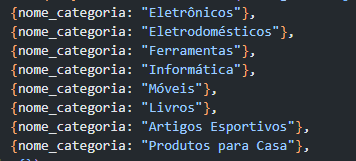
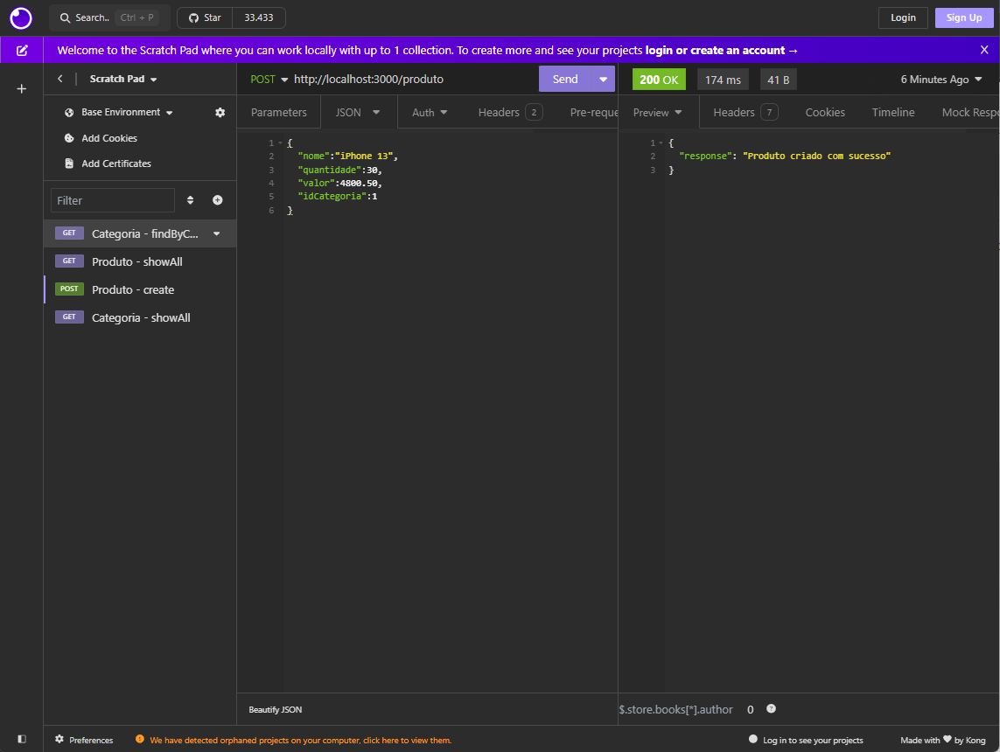
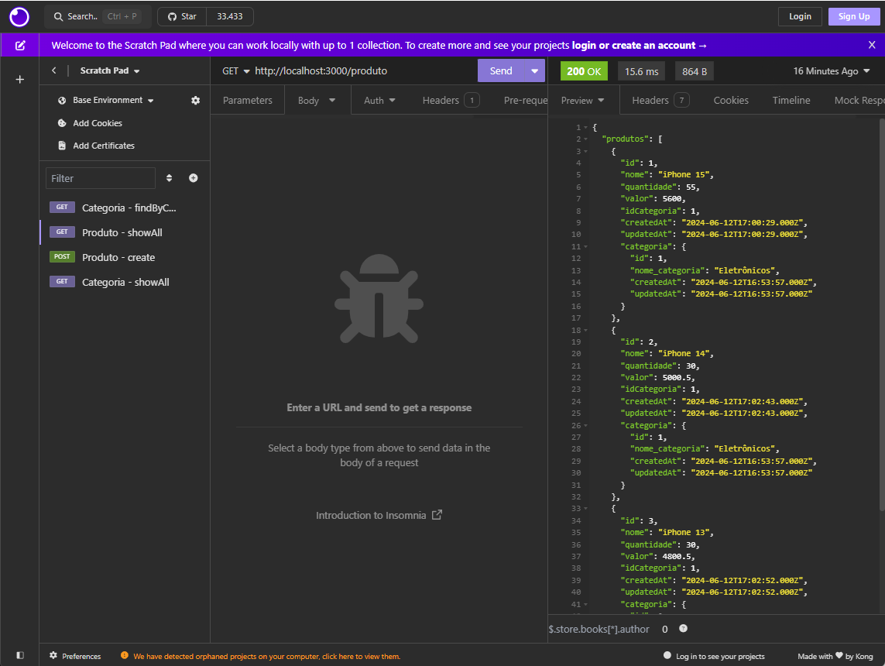
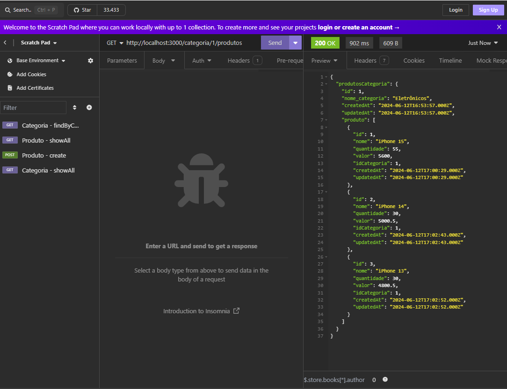

# Trabalho de Web: API de Produto

Esse trabalho foi desenvolvido como atividade referente a disciplina de Web II da turma de ADS da ESBAM.
**Aluna:*** Caio Cesar Miranda dos Santos
**Professor:** Érico Borgonove

## Sobre o trabalho

A API foi desenvolvida utilizando Node.js e usando o ORM Sequelize para criar o relacionamento e mapeamento de entidades usando banco MySQL.

Foram criadas duas tabelas relacionadas, **Produtos** que possui o código de uma categoria e **Categoria** que possui muitos produtos.

Para testes, foram criadas algumas categorias através de uma seed conforme imagem abaixo:

As duas entidades possuem rotas para visualizar todas as categorias/produtos, visualizar um único produto/categoria, além de criar, atualizar e deletar um produto ou categoria. Além disso, também foi criado uma rota para visualizar todos os produtos de uma categoria:

**Criando produtos:**

**Mostrando todos os produtos:**

**Mostrando todos os produtos de uma categoria:**

